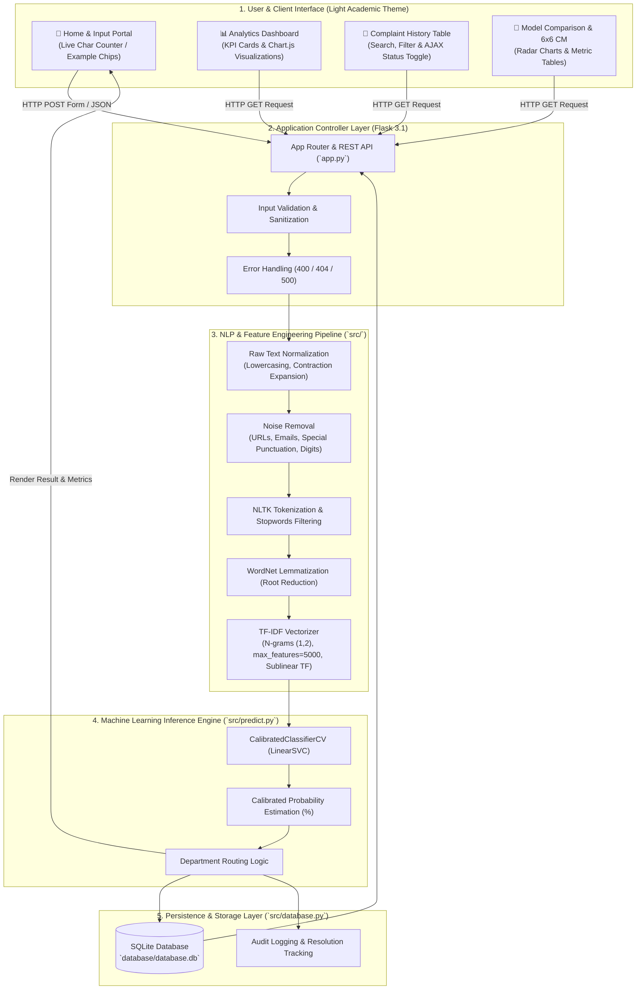

# 🏦 Customer Complaint Classification & Department Routing System
### Academic B.Tech Project-Based Learning (NLP PBL) — Academic Year 2026–27
**Department of Computer Engineering, Sanjivani College of Engineering, Kopargaon**

[](https://www.python.org/)
[](https://flask.palletsprojects.com/)
[](https://scikit-learn.org/)
[](https://www.nltk.org/)
[](https://www.chartjs.org/)
[](tests/)
[](LICENSE)

---

## 📌 1. Executive Summary

The **Customer Complaint Classification System** is an end-to-end Natural Language Processing (NLP) and Machine Learning (ML) platform designed to automate the triage and routing of unstructured customer grievances. 

Manual complaint triage in enterprise systems suffers from high latency, human error, and inconsistent routing. This system applies a rigorous text preprocessing pipeline, sublinear TF-IDF vectorization, and a probability-calibrated **Linear Support Vector Machine (LinearSVC)** classifier to achieve **98.37% test accuracy** across **6 operational categories**, automatically directing grievances to their designated departments.

---

## 🏛️ 2. System Architecture



---

## 🗂️ 3. Complaint Categories & Department Routing

The system classifies complaints across **6 mutually exclusive categories**:

| # | Complaint Category | Scope & Example Grievances | Target Department |
|:---:|:---|:---|:---|
| 1 | 💳 **Payment Issue** | Payment deducted but order unconfirmed, gateway timeout, double charges | **Finance / Payments Team** |
| 2 | 🧾 **Billing Issue** | Unexpected recurring charges, invoice calculation errors, disputed fees | **Billing Department** |
| 3 | 🔧 **Technical Issue** | Mobile application crashes, HTTP 500 server errors, UI glitch, API failure | **Technical Support / IT** |
| 4 | 📦 **Delivery Issue** | Delayed parcels, broken items on arrival, inaccurate tracking updates | **Logistics & Delivery** |
| 5 | 👤 **Account Issue** | Password reset failure, 2FA code not received, account lockout | **Account & Security Team** |
| 6 | 🎧 **Service Issue** | Rude representative behavior, prolonged hold times, unhelpful staff | **Customer Support / Escalations** |

---

## 🔬 4. NLP Preprocessing & Feature Extraction

### Preprocessing Pipeline (`src/preprocessing.py`)
1. **Case Normalization**: Converts all text to lowercase to ensure vocabulary uniformity.
2. **Contraction Expansion**: Replaces English contractions (e.g., `can't` $\to$ `cannot`, `wasn't` $\to$ `was not`).
3. **Regex Noise Stripping**: Strips URLs (`https?://\S+`), email addresses, HTML tags, punctuation, and digits.
4. **Tokenization**: Uses NLTK's `word_tokenize` to segment strings into grammatical tokens.
5. **Stop-Word Removal**: Removes non-discriminative words using NLTK's English stopword corpus.
6. **WordNet Lemmatization**: Reduces inflected variants to canonical dictionary lemmas (`crashes`, `crashing` $\to$ `crash`).

### TF-IDF Feature Extraction (`src/feature_extraction.py`)
- **N-gram Range**: $(1, 2)$ — Captures both single keywords and two-word phrases.
- **Max Features**: $5,000$ most informative lexical features.
- **Sublinear TF Scaling**: Replaces term frequency $\text{tf}$ with $1 + \log(\text{tf})$ to dampen the influence of repeated words.
- **Normalization**: $L_2$ Euclidean normalization.

$$\text{TF-IDF}(t, d, D) = (1 + \log(\text{tf}(t, d))) \times \log\left(\frac{1 + |D|}{1 + \text{df}(t, D)}\right) + 1$$

> **Academic Rigor — Zero Data Leakage**:
> The `TfidfVectorizer` is **fitted exclusively on the training split (`X_train`)**. The test set (`X_test`) is transformed using the pre-fitted vocabulary, guaranteeing zero test set contamination.

---

## 🏆 5. Machine Learning Model Evaluation Benchmark

All candidate models were trained and benchmarked on a stratified 80/20 train-test split ($N = 2,450$ complaints):

| Algorithm | Test Accuracy | Precision (Weighted) | Recall (Weighted) | F1-Score (Weighted) | Status |
|:---|:---:|:---:|:---:|:---:|:---:|
| 🥇 **Linear Support Vector Machine (LinearSVC)** | **98.37%** | **98.51%** | **98.37%** | **98.38%** | 🏆 **Best Model (Production)** |
| 🥈 **Logistic Regression** | **97.55%** | **97.72%** | **97.55%** | **97.56%** | Benchmark |
| 🥉 **Multinomial Naive Bayes** | **96.73%** | **96.87%** | **96.73%** | **96.74%** | Benchmark |

### 6×6 Confusion Matrix (Linear SVM)

| Actual \ Predicted | Account | Billing | Delivery | Payment | Service | Technical |
|:---|:---:|:---:|:---:|:---:|:---:|:---:|
| **Account** | **78** | 0 | 0 | 0 | 0 | 1 |
| **Billing** | 0 | **83** | 0 | 1 | 0 | 0 |
| **Delivery** | 0 | 0 | **81** | 0 | 1 | 0 |
| **Payment** | 0 | 1 | 0 | **82** | 0 | 0 |
| **Service** | 0 | 0 | 1 | 0 | **80** | 1 |
| **Technical** | 1 | 0 | 0 | 0 | 1 | **80** |

---

## 📁 6. Repository Structure

```
customer-complaint-classification/
├── app.py                     # Flask application entry point & API routes
├── requirements.txt           # Python dependency specifications
├── .gitignore                 # Exclusion rules for virtual environments & caches
├── README.md                  # Comprehensive academic & operational documentation
├── dataset/
│   ├── generate_dataset.py    # Balanced dataset generator (2,450 labeled samples)
│   ├── complaints.csv         # Labeled complaints dataset
│   └── README.md              # Dataset schema & distribution documentation
├── src/
│   ├── __init__.py            # Package initialization
│   ├── preprocessing.py       # Full NLP cleaning, tokenization & lemmatization
│   ├── feature_extraction.py  # TF-IDF vectorizer configuration & extraction
│   ├── train_model.py         # Multi-model training, calibration & serialization
│   ├── evaluate_model.py      # Classification reports, confusion matrices & metrics
│   ├── predict.py             # Inference engine & department routing
│   └── database.py            # SQLite schema, CRUD operations & analytics queries
├── models/
│   ├── complaint_model.pkl    # Serialized production classifier (Calibrated LinearSVC)
│   ├── tfidf_vectorizer.pkl   # Serialized TF-IDF vectorizer artifact
│   ├── label_encoder.pkl      # Serialized class label encoder
│   └── model_metrics.json     # Benchmark evaluation metrics & reports
├── templates/
│   ├── base.html              # Base template with responsive dark navy sidebar & topbar
│   ├── index.html             # Complaint submission UI with live character count
│   ├── result.html            # Detailed classification result & probability gauge
│   ├── dashboard.html         # Interactive analytics dashboard with Chart.js
│   ├── history.html           # Complaint audit log with filtering & status updates
│   ├── model_comparison.html  # Model benchmark table, radar chart & 6x6 confusion matrix
│   ├── about.html             # Academic project documentation & system workflow
│   └── error.html             # Error handling template (404/500)
├── static/
│   ├── css/
│   │   └── style.css          # Unified light-theme academic design system
│   └── js/
│       ├── main.js            # General UI helpers
│       ├── dashboard.js       # Animated counter utilities
│       ├── history.js         # Status update AJAX handler
│       └── model_comparison.js# Dynamic confusion matrix fetcher
├── docs/
│   ├── ARCHITECTURE.md        # Architectural design specifications
│   ├── API_DOCUMENTATION.md   # REST API endpoint documentation
│   └── PROJECT_REPORT.md      # Comprehensive academic project report
└── tests/
    └── test_all.py            # 47 comprehensive unit & integration tests
```

---

## 🚀 7. Quick Start & Installation

### Prerequisites
- **Python**: 3.10, 3.11, 3.12, or 3.13
- **Git**

### Step 1: Clone Repository & Create Virtual Environment
```bash
git clone https://github.com/sairajnaikwade/customer-complaint-classification.git
cd customer-complaint-classification

# Create virtual environment
python -m venv venv

# Activate virtual environment:
# Windows (PowerShell / Command Prompt):
venv\Scripts\activate
# macOS / Linux:
source venv/bin/activate
```

### Step 2: Install Dependencies & Download NLTK Corpora
```bash
pip install -r requirements.txt
python -c "import nltk; nltk.download('punkt'); nltk.download('punkt_tab'); nltk.download('stopwords'); nltk.download('wordnet')"
```

### Step 3: Run the Test Suite
```bash
python -m pytest tests/test_all.py -v
```
*Expected output: `47 passed`.*

### Step 4: (Optional) Retrain Models
```bash
python src/train_model.py
```

### Step 5: Launch the Application
```bash
python app.py
```
Access the application in your browser at: **`http://127.0.0.1:5000`**

---

## 📡 8. REST API Specifications

### 1. Predict Complaint Category
- **Endpoint**: `POST /predict`
- **Headers**: `Content-Type: application/json`
- **Request Body**:
  ```json
  {
    "complaint": "My payment was deducted from my account but the order was never confirmed."
  }
  ```
- **Response (`200 OK`)**:
  ```json
  {
    "id": 1,
    "category": "Payment Issue",
    "confidence": 98.42,
    "department": "Finance / Payments Team",
    "top_features": ["payment", "deducted", "order", "confirmed"],
    "all_probabilities": {
      "Account Issue": 0.003,
      "Billing Issue": 0.008,
      "Delivery Issue": 0.002,
      "Payment Issue": 0.9842,
      "Service Issue": 0.001,
      "Technical Issue": 0.0018
    }
  }
  ```

### 2. Dashboard Analytics
- **Endpoint**: `GET /api/dashboard`
- **Response (`200 OK`)**:
  ```json
  {
    "stats": {
      "total": 45,
      "resolved": 28,
      "pending": 17,
      "by_category": {
        "Payment Issue": 12,
        "Technical Issue": 9,
        "Delivery Issue": 8,
        "Billing Issue": 7,
        "Account Issue": 5,
        "Service Issue": 4
      },
      "avg_score": 97.85
    },
    "best_model": {
      "model": "Linear Support Vector Machine",
      "accuracy": 98.37,
      "precision": 98.51,
      "recall": 98.37,
      "f1_score": 98.38
    }
  }
  ```

---

## 🛠️ 9. Technology Stack

| Domain | Technology | Purpose |
|:---|:---|:---|
| **Core Language** | Python 3.13 | Core runtime and backend scripting |
| **Web Framework** | Flask 3.1 | Application routing, Jinja2 template rendering, REST API |
| **Machine Learning** | scikit-learn 1.6+ | LinearSVC, Logistic Regression, MultinomialNB, CalibratedClassifierCV |
| **NLP Engine** | NLTK 3.9+ | Tokenization, English stopwords filtering, WordNet Lemmatizer |
| **Data Processing** | Pandas 2.2+, NumPy 2.0+ | Dataset manipulation, array operations, matrix transformations |
| **Database** | SQLite3 | Embedded thread-safe audit logging & CRUD operations |
| **Data Visualization** | Chart.js 4.4 | Responsive bar, donut, and radar performance charts |
| **Automated Testing** | pytest 9.1+ | 47 unit and integration tests |

---

## 👥 10. Academic Attribution

- **Project**: Customer Complaint Classification System
- **Subject**: Natural Language Processing (NLP) — Project-Based Learning (PBL)
- **Institution**: Sanjivani College of Engineering, Kopargaon
- **Department**: Department of Computer Engineering
- **Academic Year**: 2026–27


